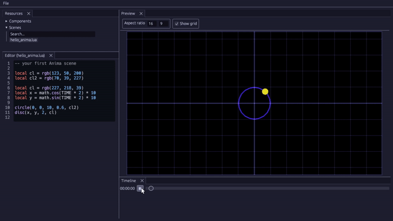

<h1 align="center">anima</h1>

A Rusty code-based animation editor. 
<i><b>🚧 Work in progress! 🚧</i></b>

## Motivation 🙌
I have always found it easier to work with visuals imperatively, picking solutions such as the JS canvas or some other 2D drawing libraries over traditional drawing software. This project aims to extend that idea to the animation realm.

## Planned features 🚀
This project is still in the experimentation phase, where I am testing out various ideas and seeing what works and what doesn't. This makes it hard to predict a stable featureset, however there are some goals that I'll be working towards:
- A Lua scripting back-end
- Basic 3D support
- Ability to embed audio
- GIF/Video export
- Built-in transition system

## Non-goals 🚀
These are all the things that anima doesn't want to be, at least at this point in time:
- A generic rendering engine
- Web player support

## Sources 📚
This project takes inspiration from Manim and Motion Canvas.
- [Manim](https://www.manim.community)
- [Motion Canvas](https://motioncanvas.io)